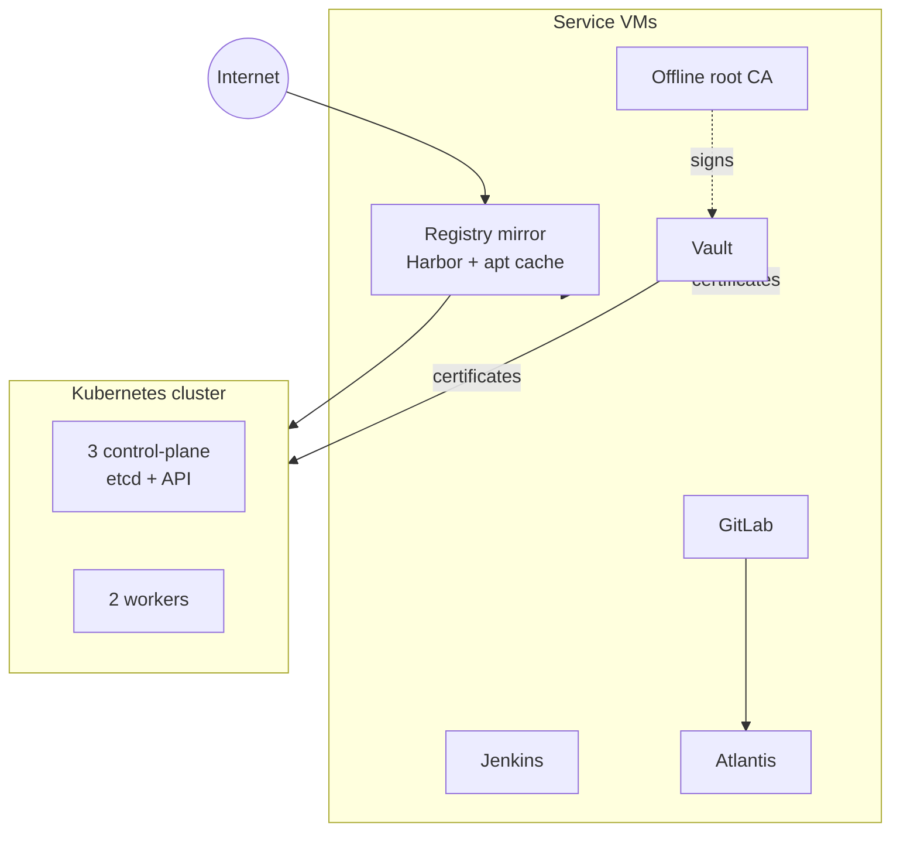

# Architecture

The platform is eight layers, each documented on its own page.

| Layer | Page | One line |
| --- | --- | --- |
| Network | [Network](network.md) | two firewall VDOMs, one lab VLAN, VIPs for the API and ingress |
| Compute | [Compute and templates](compute.md) | one host, four storage tiers, two cloud-init templates |
| Supply chain | [Air-gapped supply chain](supply-chain.md) | one mirror host is the only door to the internet |
| Trust | [PKI and secrets](pki-and-secrets.md) | offline root, Vault intermediate, automatic issuance |
| Provisioning | [Provisioning flow](provisioning-flow.md) | merge request to running VM with a certificate |
| Kubernetes | [Kubernetes platform](kubernetes-platform.md) | hard-way cluster plus ingress, storage, certificates |
| Observability | [Observability](observability.md) | Prometheus and Grafana for the cluster and every VM |
| Backup | [Backup](backup.md) | nightly snapshot backups of every VM to a NAS |

