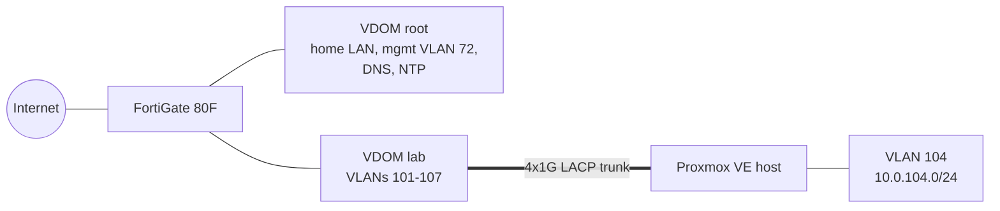

# Network

One FortiGate 80F splits into two VDOMs: `root` keeps the home network, management
VLAN, DNS and the internet uplink; the `lab` VDOM trunks VLANs 101-107 to the
Proxmox host over a four-port LACP bond. The platform lives on VLAN 104.

## VLAN 104 address plan

| Range | Use | Assigned by |
| --- | --- | --- |
| `.1` | gateway (firewall) | static |
| `.6` | Kubernetes API VIP | firewall server load balancer |
| `.7` | ingress VIP for every web app | firewall server load balancer |
| `.10`-`.49` | service VMs | DHCP reservation by MAC |
| `.50`-`.99` | Kubernetes nodes | DHCP reservation by MAC |
| `.100`-`.200` | dynamic pool | DHCP |

Addresses come from DHCP reservations, not static cloud-init settings, so the
firewall stays the single source of truth for who owns which address.

## DNS

The firewall is authoritative for the internal domain. Each web application gets one
A record pointing at the ingress VIP; routing happens on the `Host` header, so no
wildcard record is needed.

## Load-balanced VIPs

The firewall's server load balancer fronts two pools:

| VIP | Port | Real servers | Health check |
| --- | --- | --- | --- |
| API `.6` | 6443 | three control-plane nodes, port 6443 | TCP 6443 |
| Ingress `.7` | 80 / 443 | two workers, NodePort 30080 / 30443 | TCP 30080 |

Policies reference the firewall **zone** that contains the VLAN interfaces, not the
interfaces themselves; a policy on an interface that sits inside a zone is rejected.

## Management access

The automation API user is restricted to an access profile with network and firewall
objects only, to the two VDOMs it needs, and to trusted source subnets. Its admin
endpoint presents a certificate issued by the internal CA, so Terraform verifies TLS
instead of running with `insecure = true`.
