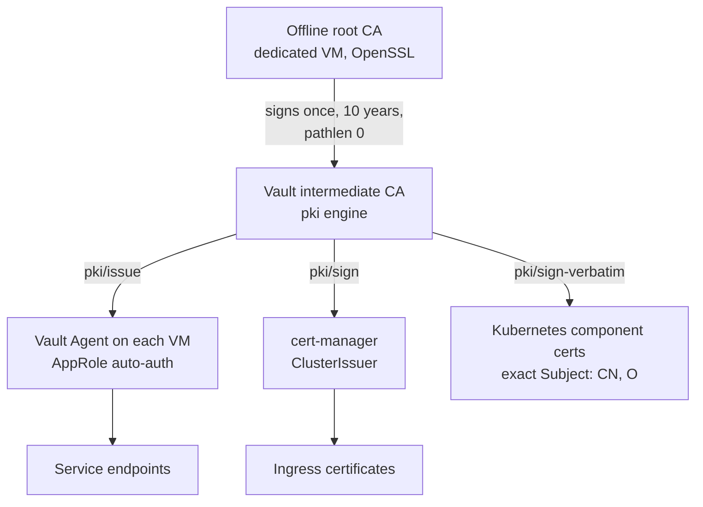

# PKI and secrets

Every TLS certificate in the lab chains to one offline root and is issued by Vault
without a human in the loop.

## Who may do what

| Identity | Auth | Allowed | Bound to |
| --- | --- | --- | --- |
| VM certificate issuer | AppRole | `pki/issue/<role>` only | lab subnet |
| Atlantis | AppRole | read automation KV, create VM secret_ids | Atlantis host |
| cert-manager | AppRole | `pki/sign/<role>` only | lab subnet + pod CIDR |
| Humans | token | everything, short-lived | - |

## Design points

- **Existing root, new intermediate.** The root CA already trusted by every client
  signs a Vault intermediate, so nothing had to be re-trusted.
  ([ADR 0004](../decisions/0004-vault-intermediate-under-offline-root.md))
- **Machines fetch their own certificates.** A VM receives only a scoped secret_id;
  its Vault Agent requests and renews the certificate.
  ([ADR 0005](../decisions/0005-vault-agent-for-vm-certificates.md))
- **Kubernetes components** need certificates whose Subject carries identity
  (`CN=system:node:<name>`, `O=system:nodes`), so they are signed with
  `sign-verbatim` from locally generated CSRs.
- **Automation secrets** (hypervisor and firewall API tokens, state backend token)
  live in a KV engine and are materialised only for the duration of a run.
