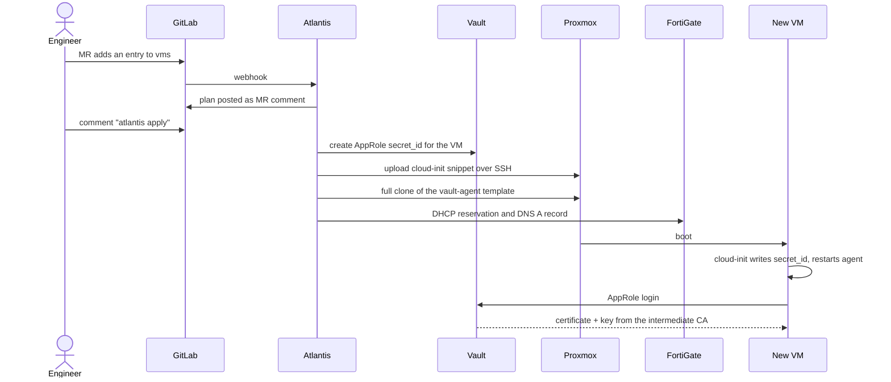

# Provisioning flow

A new VM is one map entry in a merge request. Atlantis plans it as an MR comment;
`atlantis apply` creates the VM, its network records and its Vault credential, and
the VM fetches its own TLS certificate on first boot.

## Derived identity

One integer per VM (`host_index`) drives everything that must agree:

- IP address: `cidrhost(subnet, host_index)`
- MAC address: `BC:24:11:E0:xx:xx` built from the same number
- DHCP reservation and DNS record: name and address from the same map entry

## State and secrets

- Terraform state lives in GitLab's HTTP state backend, with locking, shared by
  engineers and Atlantis ([ADR 0008](../decisions/0008-gitlab-managed-terraform-state.md)).
- Secrets are read from Vault on the Atlantis host right before a run and handed to
  the container as an env file; nothing secret is stored in the repository or image.

## Safety rails

- Existing firewall records are imported and passed back in, so the first apply is a
  no-op ([ADR 0009](../decisions/0009-adopt-firewall-records-without-owning-them.md)).
- The firewall API user can touch only network objects in two VDOMs, from trusted
  subnets only.

Code: [terraform/](https://github.com/viktor-code-lab-sys/proxmox-homelab-iac/tree/main/terraform),
[atlantis/](https://github.com/viktor-code-lab-sys/proxmox-homelab-iac/tree/main/atlantis).
