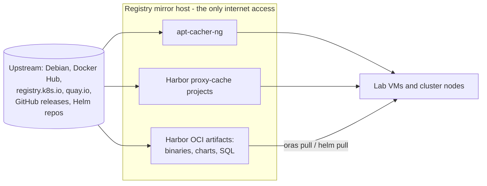

# Air-gapped supply chain

Only the registry mirror host may reach the internet. Every other machine installs
from it, which makes the lab reproducible, auditable and immune to upstream outages.

| Artifact | Mechanism |
| --- | --- |
| Debian packages | apt-cacher-ng, clients point to it through an APT proxy setting |
| Container images | Harbor proxy-cache projects per upstream: `dockerhub-proxy`, `k8s-proxy`, `quay-proxy` |
| Kubernetes binaries, tarballs, manifests, SQL | OCI artifacts in the `k8s-binaries` project, pushed and pulled with ORAS |
| Helm charts | OCI charts in the `helm-charts` project |

Proxy-cache projects are private; nodes and pipelines authenticate with a robot
account that can only pull. Harbor's Trivy scanner runs against everything cached.

Two practical rules follow:

- The very first tool on a fresh VM (`oras`) is copied from the mirror host with
  `scp`; after that, everything else comes through ORAS.
- Helm values set registry and repository per component; a global override breaks
  images that do not come from the assumed upstream
  ([lesson](../lessons-learned/helm-image-overrides-air-gapped.md)).

Code: [supply-chain/](https://github.com/viktor-code-lab-sys/proxmox-homelab-iac/tree/main/supply-chain).
