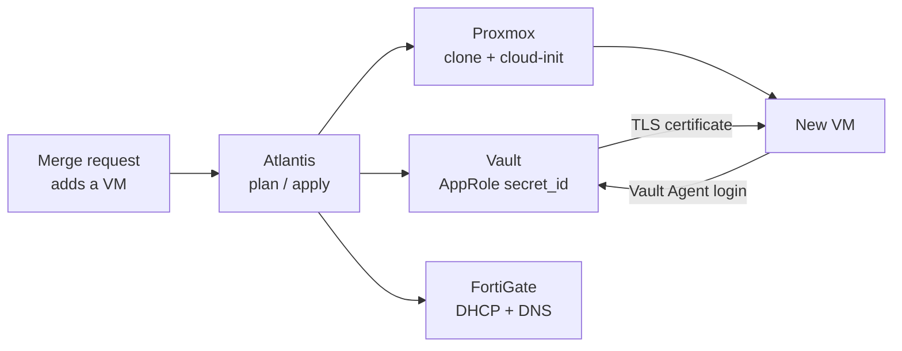

# Proxmox Homelab Platform

A single-host private cloud built the way a production platform is built: an
air-gapped supply chain, self-service VMs from merge requests, an internal PKI that
issues every certificate without a human, and a Kubernetes cluster assembled by hand.

| | |
| --- | --- |
| Hardware | one Proxmox VE host - Ryzen 5 PRO 4650G (6C/12T), 46 GB RAM, four SSD tiers |
| Kubernetes | v1.31, built the hard way: 3 control-plane nodes with HA etcd + 2 workers |
| Service VMs | GitLab, registry mirror (Harbor + apt cache), Jenkins, Vault, Atlantis, offline root CA |
| Provisioning | merge request &rarr; VM with DHCP reservation, DNS record and TLS certificate in about a minute |
| Internet access | exactly one host; everything else pulls through it |
| Workloads | Nextcloud 35, Apache Guacamole 1.6, Prometheus + Grafana |

## Goals and constraints

- **Production habits on lab hardware.** Everything is code, reviewed in a merge
  request, applied by automation, and documented with the reasoning behind it.
- **Air-gapped by default.** Lab machines never download from the internet; one
  mirror host fetches, scans and serves every package, image, chart and binary.
- **Shared network.** The firewall also serves the home network. Automation may add
  records next to hand-made ones but must never remove them.
- **Learn the internals.** Kubernetes is assembled from binaries and certificates
  rather than installed with kubeadm, so every failure has to be understood.

## The headline flow

Details: [Provisioning flow](architecture/provisioning-flow.md).

## Where to start

- **Ten-minute tour:** [Architecture](architecture/index.md), then the
  [provisioning flow](architecture/provisioning-flow.md).
- **Why it is built this way:** [Decisions](decisions/index.md) - each record
  names the alternatives that lost.
- **What broke and how it was found:** [Lessons learned](lessons-learned/index.md).
- **Rebuild it:** [Runbook](runbook/index.md) and the code in
  [proxmox-homelab-iac](https://github.com/viktor-code-lab-sys/proxmox-homelab-iac).

## Status

The lab ran end to end in 2026 and has since been decommissioned. This site and
the code are the complete record of it; what I would build next is in the
[Roadmap](roadmap.md).

All hostnames and addresses on this site are placeholders (`homelab.example`,
`10.0.0.0/16`); the real values and every secret stay private.
